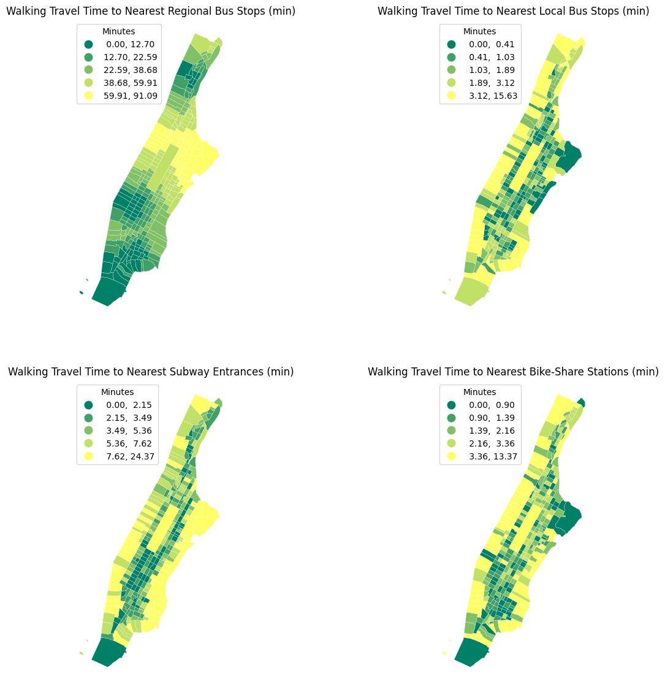
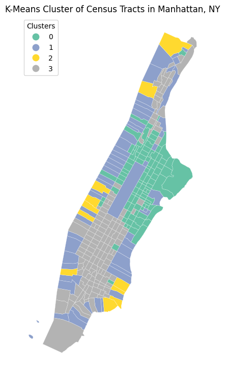
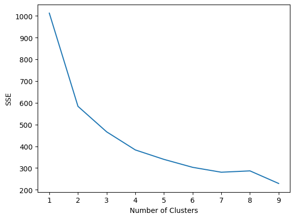

# Manhattan mobility access

**Tract-level socioeconomic inequalities in walking time to public and shared mobility in
Manhattan** — a network-analysis, clustering and spatial-regression study of 303 census tracts.


[](https://github.com/Sidbaobao/My_Projects/blob/main/reports/manhattan-mobility-access.pdf)
[](LICENSE)

> To what extent do tract-level socioeconomic characteristics explain inequalities in access to
> public and shared mobility systems in Manhattan?

| | |
|---|---|
| Notebook | [`manhattan_mobility_access.ipynb`](manhattan_mobility_access.ipynb) — the complete pipeline, from the OpenStreetMap download to the regression tables |
| Report | [Assessing tract-level socioeconomic inequalities in walking time to shared mobility systems in Manhattan](https://github.com/Sidbaobao/My_Projects/blob/main/reports/manhattan-mobility-access.pdf) (PDF, 14 pages) |
| Figures | [`figures/`](figures/) — exported from the notebook |

## Questions and hypotheses

| | Question | Hypothesis | Result |
|---|---|---|---|
| Q1 | How long does it take to reach the nearest bus stop, subway entrance and bike-share station? | Subways are the quickest to reach | **Rejected** — subway entrances take roughly twice as long to reach as bus stops or bike-share stations |
| Q2 | Are there spatial patterns in accessibility? | Lower Manhattan / Midtown is best served | **Supported** — Midtown and the Financial District form the high-access cluster; river-edge tracts and, for the subway, East Harlem are the least accessible |
| Q3 | Which socioeconomic factors relate to those patterns? | Poverty and race are both associated with poorer access | **Partly** — poverty is associated with longer walking times to buses and subways; racial composition is not statistically significant |

## Data

| Source | Content | Size |
|---|---|---|
| OpenStreetMap (via OSMnx) | walking network of Manhattan; `highway=bus_stop`, `railway=subway_entrance`, `amenity=bicycle_rental` | 1,677 local bus stops · 842 subway entrances · 702 bike-share stations |
| ACS 2020 5-year estimates (Census API) | population density, % White non-Hispanic, % below poverty, % commuting by car, % commuting by transit | 303 tracts |
| TIGER/Line 2020 | census-tract boundaries, New York County (FIPS 061) | 303 tracts |

Regional bus stations (11 in OpenStreetMap) were dropped: too few for inference and not part of
local accessibility.

## Method

```
OSM walking network  ──►  snap amenities and tract centroids to the nearest network nodes
                     ──►  multi-source Dijkstra on travel_time (5 km/h), one run per mode
                     ──►  walking time to the nearest bus stop / subway entrance / bike-share station, per tract
                     ──►  quintile choropleths and histograms
                     ──►  robust scaling + K-means (elbow method → k = 4) → accessibility typologies
                     ──►  OLS per mode with a spatial-lag term (libpysal weights) on the ACS covariates
```

<p align="center">
  
</p>

## Findings

**Walking time.**  Most tracts are within about 2 minutes of a bus stop or a bike-share station
but around 5 minutes from a subway entrance.  Access is weakest on the river-facing edges of
the island; East Harlem is well served by buses and bike share but poorly by the subway.

**Four accessibility typologies** (K-means on the three walking times):

| Cluster | Mean walking time (min): bus · subway · bike share | Where |
|---|---|---|
| 1 — closest to everything | 1.08 · 2.65 · 1.41 | Midtown, Financial District |
| 3 — close to bus and bike share, far from the subway | — | East Harlem and other subway gaps |
| 2 — moderately far from everything | 4.06 · 7.99 · 4.25 | transitional tracts |
| 0 — farthest from everything | — | outlying and river-edge tracts |

<p align="center">
  
  
</p>

**Spatial regression** (walking time as the dependent variable, spatial lag included, n = 303):

| Covariate | Bus stops | Subway entrances |
|---|---|---|
| % below poverty level | **+3.30 min** (p = 0.011) | **+5.38 min** (p = 0.010) |
| % commuting by public transit | −1.62 min (p = 0.041) | −3.30 min (p = 0.008) |
| log population density | −0.24 (p = 0.050) | −0.56 (p = 0.004) |
| % White non-Hispanic | not significant | not significant |
| spatial lag | 1.25 (p < 0.001) | 1.83 (p < 0.001) |
| adjusted R² | 0.24 | — |

Poverty is associated with longer walks to both bus and subway; tracts where more people commute
by transit are closer to it; racial composition has no significant effect once poverty and
density are controlled for.  Walking time is only one facet of accessibility — service
frequency, crowding and cost are not measured — so the results describe proximity, not quality
of service.

## Reproduce

```bash
pip install -r requirements.txt
echo 'CENSUS_KEY = "your-census-api-key"' > key.py   # https://api.census.gov/data/key_signup.html
jupyter notebook manhattan_mobility_access.ipynb
```

`key.py` is git-ignored.  Downloading the Manhattan walking network from OpenStreetMap takes a
few minutes on the first run.

## Context

Independent course project for a data-science class at Cornell University (Master of Regional
Planning), 2026.  Data pipeline, analysis, notebook and report by Junxiang Gong.

## License

MIT — see [LICENSE](LICENSE).
